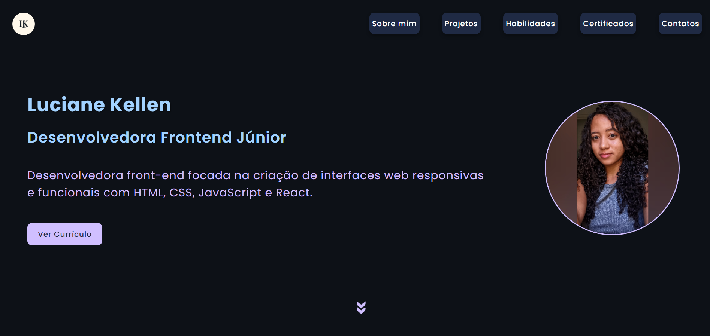
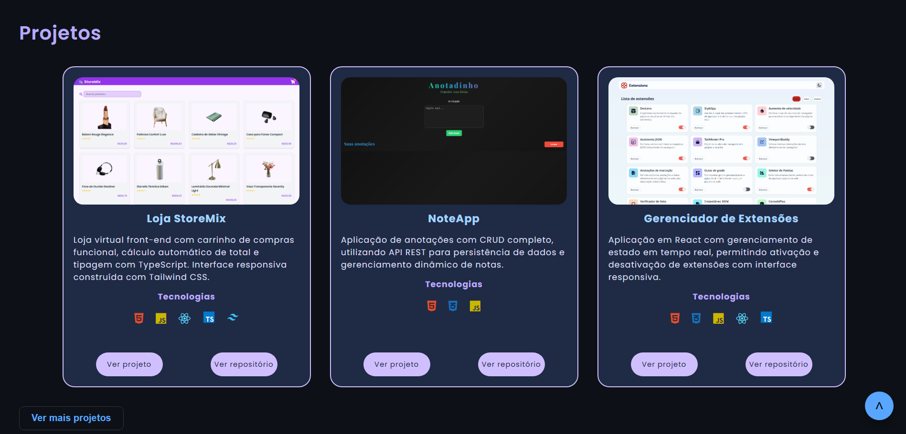

# Portfolio - Luciane Kellen

### 🔗 Live Project

👉  (https://portfolio-luciane.vercel.app/)

## 🇺🇸 English

This is my personal front-end developer portfolio, built to showcase my projects, skills, and learning journey.

The application is fully responsive and focuses on clean UI, accessibility, and modern web practices using HTML, CSS, and JavaScript.

### ✨ Features
- Responsive layout
- About Me section
- Project showcase section
- Skills and technologies display
- My certificates
- Interactive UI with animations
- Contact section with social links

### 🛠️ Technologies

  
  
   

   

### 📸 Preview

#### Primeira imagem

  

#### Segunda imagem

  

### 🚀 Future Improvements
- React.js migration for component-based structure
- Better state management for projects section

## Author
Luciane Kellen

---

## 🇧🇷 Português

Este é meu portfólio pessoal como desenvolvedora front-end, criado para apresentar meus projetos, habilidades e evolução na área de tecnologia.

A aplicação é totalmente responsiva, com foco em interface limpa, acessibilidade e boas práticas de desenvolvimento web utilizando HTML, CSS e JavaScript.

### ✨ Funcionalidades
- Layout responsivo 
- Seção sobre mim
- Seção de projetos
- Exibição de habilidades
- Certificados
- Interface interativa com animações
- Área de contato com links sociais

### 🛠️ Tecnologias

  
  
  

   

### 📸 Prévia

#### Primeira imagem

  

#### Segunda imagem

  

### 🚀 Melhorias futuras
- Migração para React.js com componentização
- Melhor organização de estado nos projetos

## Autor
Luciane Kellen